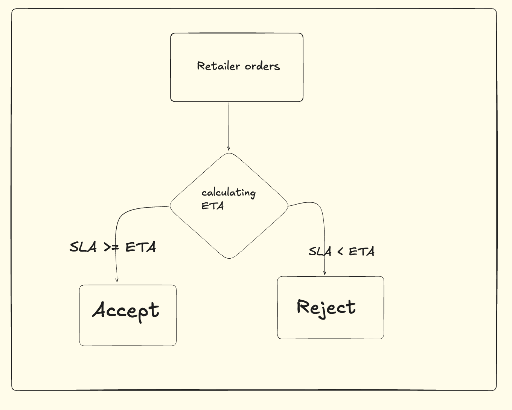

# Dynamic-Slot-Capacity-Order-Throttling

This project solves a quick-commerce operations problem: whether a new retailer order should be accepted or rejected at the time of placement.

The goal is to prevent warehouse and rider overload during peak periods while protecting delivery SLA.  
For every incoming order, the system estimates the expected delivery time (ETA) and compares it against the promised SLA. If the order can be fulfilled safely within capacity, it is accepted. Otherwise, it is rejected.

## Problem Statement

In quick-commerce systems, accepting every incoming order can overload the warehouse and last-mile delivery network, especially during busy periods such as morning and lunch peaks.

This project builds a practical decision engine that checks whether a new order should be **ACCEPTED** or **REJECTED** in real time based on operational conditions such as rider availability, current queue load, delivery distance, and current delivery performance.



## How It Works

For each incoming order, the system uses live operational inputs to estimate whether the order can be delivered safely.

The decision is made in the following steps:

- Check basic constraints such as rider availability and serviceable distance
- Estimate pick-pack time using the number of items
- Estimate travel time using delivery distance
- Estimate queue wait using current backlog and active riders
- Add extra penalty during peak hours or when current delivery time is already high
- Compute the predicted ETA
- Compare predicted ETA with SLA
- Accept the order only if the system remains within safe dynamic capacity

## Inputs Used

The system takes the following inputs from the frontend:

- `warehouse_id`
- `active_riders`
- `orders_in_queue`
- `avg_delivery_time`
- `distance`
- `items_count`
- `order_created_time`

These values are used to estimate the predicted delivery time and determine whether the order should be accepted or rejected.

## Decision Rule

The order is **ACCEPTED** if:

- predicted ETA is less than or equal to SLA
- queue after accepting the order remains within safe dynamic capacity

The order is **REJECTED** if:

- there are no active riders
- the order is outside the serviceable distance
- predicted ETA exceeds SLA
- the system is already overloaded

## How to Run the Project

1. Clone the repository
2. Install dependencies
3. Run the Flask backend
4. Open the frontend in the browser
5. Enter order details and check the decision

### Commands

```bash
pip install -r requirements.txt
python app.py

Open: http://127.0.0.1:5000

## Conclusion

This project demonstrates a simple and practical real-time order acceptance engine for quick-commerce operations.

Instead of accepting every order blindly, the system estimates ETA and checks operational capacity before making a decision. This helps protect SLA, avoid warehouse overload, and improve delivery reliability during busy periods.

The solution is intentionally lightweight, explainable, and easy to understand, making it suitable as a strong first version for real operational use.
